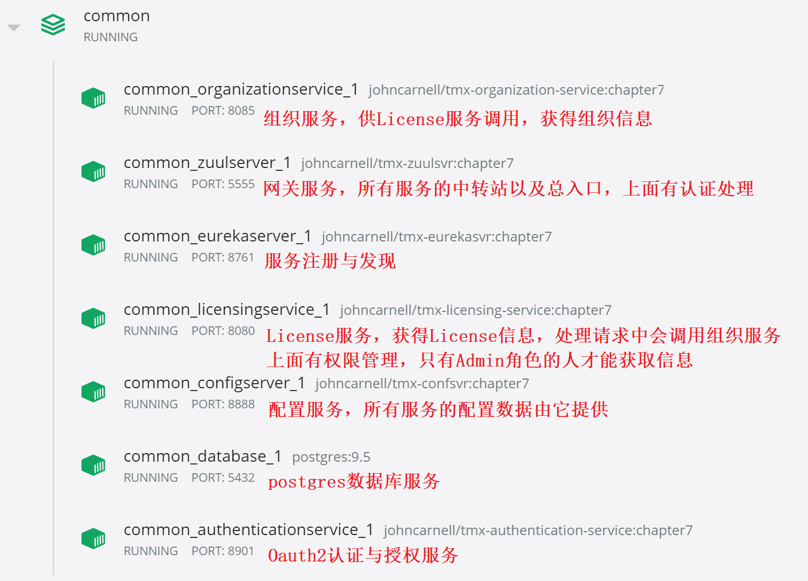

# 一个分布式系统部署运行的例子
## 一、docker环境部署
+ cd到docker/common子目录运行：
####  `docker-compose up`
## 二、部署的服务有：

## 三、curl调用的例子
+ 访问Oauth2服务器，用户认证，获得访问token：
####  `curl  eagleeye:thisissecret@localhost:8901/auth/oauth/token -d grant_type=password -client_id=eagleeye  -d scope=webclient -d username=john.carnell -d password=password1`
####  `curl  eagleeye:thisissecret@localhost:8901/auth/oauth/token -d grant_type=password -client_id=eagleeye  -d scope=webclient -d username=william.woodward -d password=password2`
+ 根据获得的token，获取用户信息：
####  `curl -H "Authorization: Bearer {{token}}" http://localhost:8901/auth/user`
+ 根据获得的token，访问服务：
####  `curl -i -H "Authorization: Bearer {{token}}" http://localhost:5555/api/licensing/v1/organizations/e254f8c-c442-4ebe-a82a-e2fc1d1ff78a/licenses/f3831f8c-c338-4ebe-a82a-e2fc1d1ff78a`
## 四、生成镜像
+ cd到各服务子目录也就是pom.xml所在目录，运行：
####  `mvn clean package docker:build`
## 五、jwt加解密可访问
+ https://www.jsonwebtoken.io/